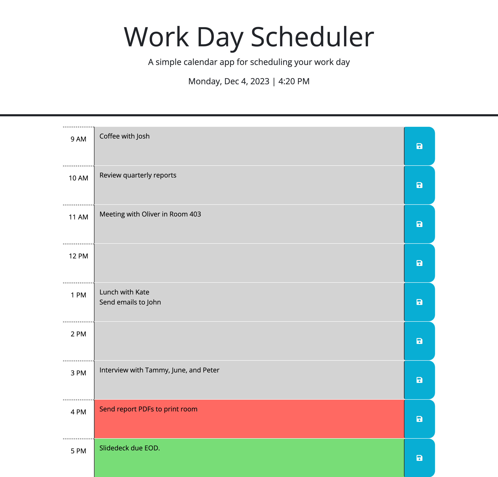
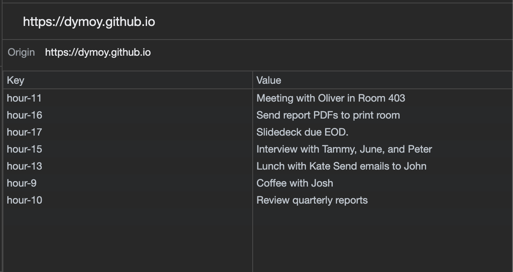

## Name 

Daily Work Day Scheduler 

## Description

The goal of this project is to create a web tool of which the user can plan their daily schedule, in a typical 9AM - 5PM work day. It implements the Day.js library to work with date and time and color codes the time blocks based on past, present, or future. 

Once the user enters an event in a time block and presses the save button, the data is saved in local storage so that the data persists, even after refreshing the page. 

## Installation 

N/A

## Usage 
Use the following link to access the deployed webpage: 
https://dymoy.github.io/work-calendar/

The source code is found in the root directory of the main branch. 

## Visuals 

### Screenshot of webpage with events entered

### Screenshot of local storage after entering events 

## Credits 
1. Day.js 
- Day.js library is used to display and format the date and time. 
- Documentation: https://day.js.org/en/

2. jQuery
- jQuery library is used to simplify DOM traversal and manipulation
- Documentation: https://jqueryui.com/demos/

3. Bootstrap 
- Bootstrap library is used to simplify HTML element styling 
- Documentation: https://getbootstrap.com/

## License 

Please refer to the license in the repo.
